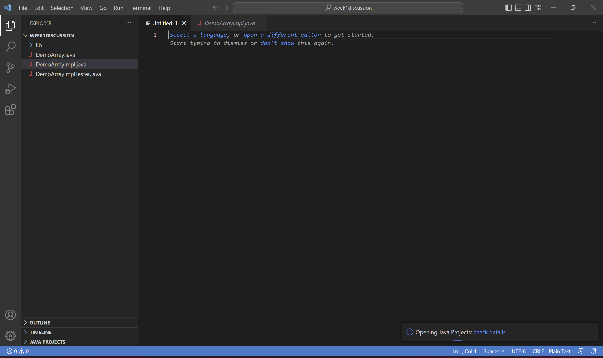
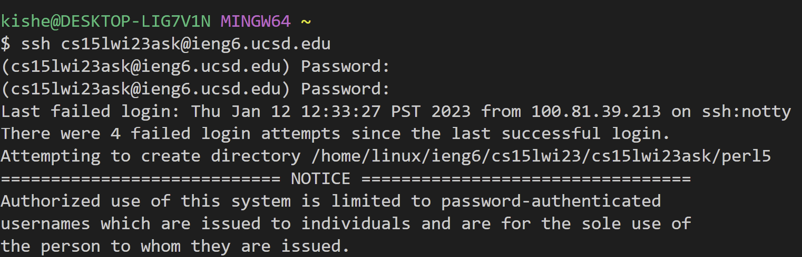
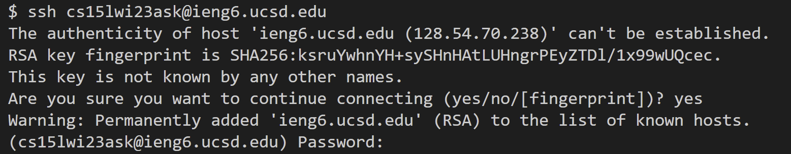
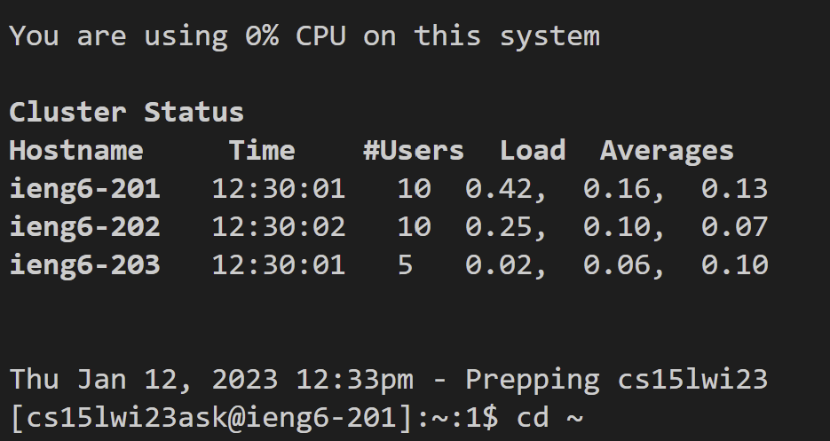
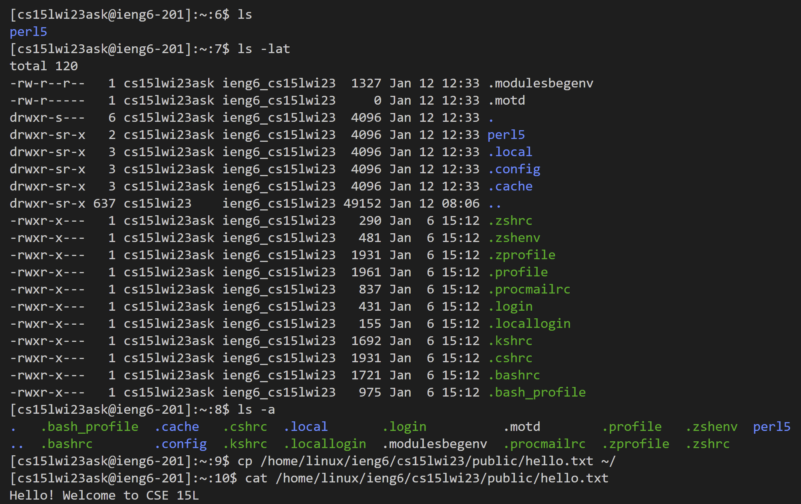

# Installing VS Code


I already had VS Code installed as I took CSE11 last quarter, so I could skip this step. However, if I had to reinstall it, I would go to this [site](https://code.visualstudio.com/download) and download the installer for windows.

# Remotely Connecting 


First I downloaded Git for Windows from this [site](https://gitforwindows.org/), selecting VS Code as my default text editor. Then I opened a terminal in VS Code and followed the steps on [this website](https://stackoverflow.com/questions/42606837/how-do-i-use-bash-on-windows-from-the-visual-studio-code-integrated-terminal/50527994#50527994) to use a git bash terminal in VScode. To summarize the website, I needed to open the terminal, open the command palette, type 'select default profile', then press the plus icon and open a git bash terminal. After that, I opened a terminal and inputted the following command:
```
$ ssh cs15lwi23ask@ieng6.ucsd.edu
```

Note that I do not need to type in the $ into the terminal. 



Then, I typed "yes" to continue connecting. Note that this should only happen once and not everytime I try to connect, as it might indicate somebody else is snooping. I then typed in my password. Note that I won't be able to see the password as it is being typed in for privacy/security reasons.


When I successfuly connected remotely, the cluster status was displayed. Also, I was now able to pass in commands.

# Trying some commands


Now I tried using various commands, including the `ls` and `ls -lat` command. `ls` is used to list non-hidden files in the current directory, while `ls -lat` is used to list hidden files as well. Note that I cannot list other users files using the `ls` command. To close the connection, I can use the `exit` command, which is is used to close the current shell. The `cp` command is used to copy files or directories.
