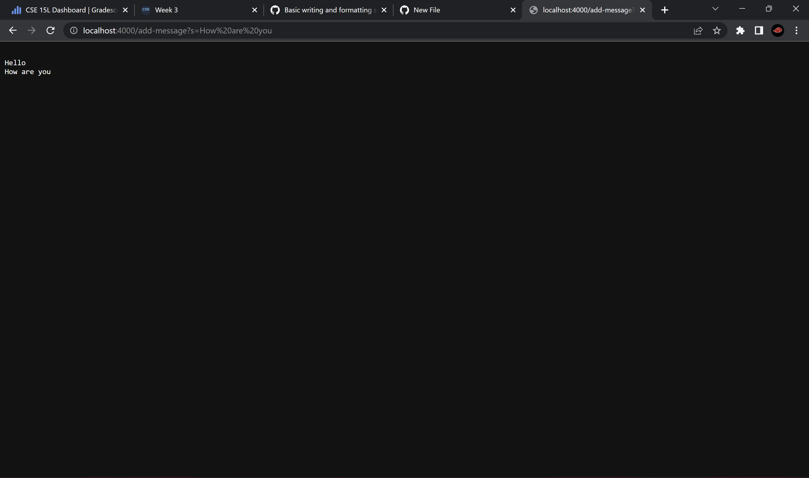

# Part 1

### StringServer.java

```
import java.io.IOException;
import java.net.URI;

class Handler implements URLHandler {
    String text = new String();

    public String handleRequest(URI url) {
        if (url.getPath().equals("/")) {
            return String.format(text);
        } else {
            System.out.println("Path: " + url.getPath());
            if (url.getPath().contains("/add-message")) {
                String[] parameters = url.getQuery().split("=");
                if (parameters[0].equals("s")) {
                    text = text.concat("\n" + parameters[1]);
                    }
                    
                return String.format(text);
                }
            }
        return "404 Not Found!";
        }
    }


class StringServer { //taken directly from wavelet
    public static void main(String[] args) throws IOException {
        if(args.length == 0){
            System.out.println("Missing port number! Try any number between 1024 to 49151");
            return;
        }

        int port = Integer.parseInt(args[0]);

        server.start(port, new Handler());
    }
}

```

### server.java (taken directly from wavelet)
```
// A simple web server using Java's built-in HttpServer

// Examples from https://dzone.com/articles/simple-http-server-in-java were useful references

import java.io.IOException;
import java.io.OutputStream;
import java.net.InetSocketAddress;
import java.net.URI;

import com.sun.net.httpserver.HttpExchange;
import com.sun.net.httpserver.HttpHandler;
import com.sun.net.httpserver.HttpServer;

interface URLHandler {
    String handleRequest(URI url);
}

class ServerHttpHandler implements HttpHandler {
    URLHandler handler;
    ServerHttpHandler(URLHandler handler) {
      this.handler = handler;
    }
    public void handle(final HttpExchange exchange) throws IOException {
        // form return body after being handled by program
        try {
            String ret = handler.handleRequest(exchange.getRequestURI());
            // form the return string and write it on the browser
            exchange.sendResponseHeaders(200, ret.getBytes().length);
            OutputStream os = exchange.getResponseBody();
            os.write(ret.getBytes());
            os.close();
        } catch(Exception e) {
            String response = e.toString();
            exchange.sendResponseHeaders(500, response.getBytes().length);
            OutputStream os = exchange.getResponseBody();
            os.write(response.getBytes());
            os.close();
        }
    }
}

public class server {
    public static void start(int port, URLHandler handler) throws IOException {
        HttpServer server = HttpServer.create(new InetSocketAddress(port), 0);

        //create request entrypoint
        server.createContext("/", new ServerHttpHandler(handler));

        //start the server
        server.start();
        System.out.println("Server Started! Visit http://localhost:" + port + " to visit.");
    }
}

```
# Server setup
First, the server is setup using `javac StringServer.java` and `java StringServer 4000`. Note any number between 1024 to 49151 can be used for as the port number. Now, the server will be running at this [link](http://localhost:4000) using the local host. This causes the "main" method in StringServer.java to be called, which calls the "start" method in server.java, passing in the port number and handler as arguments. It then creates a HttpServer object with the port number, to create the server.


# Hello Screenshot

After typing in `/add-message?s=Hello` into the searchbar, the page shows `Hello`. I think that when the address is searched for, the handle method in the server.java file calls the handleRequest method in StringServer.java, passing in the url. This creates the "text" string. When `/add-message?s=Hello` is entered, the text is set to `text.concat("\n" + parameters[1])`, where paramaters is a String array, and the element at the first index are the characters after the "=". The `\n` represents the new line character, so a new line is created after each phrase.


# How are you Screenshot

After typing in `/add-message?s=How are you` into the searchbar, the page shows:
```
Hello
How are you
```
The same methods are called as before, and the text is set to `text.concat("\n" + parameters[1])`. The processing is done in the same way as Hello, but instead now its How are you. The spaces are not an issue as they are whitespace characters which can be added to a string.
